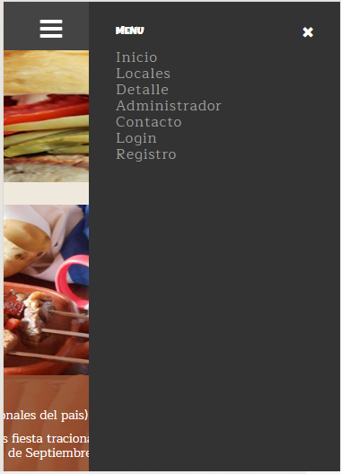

# Proyecto: Descubriendo Sabores - Aplicación de Comida Tradicional Chilena

## Descripción

"Descubriendo Sabores" es una aplicación web diseñada para promover y explorar la comida tradicional chilena. Esta aplicación fue desarrollada utilizando HTML, CSS, JavaScript y Bootstrap, con el objetivo de proporcionar una experiencia visualmente atractiva y responsiva para los usuarios interesados en la gastronomía chilena.

## Imágenes Principales

## Características Actuales

- **Interfaz Atractiva**: Utiliza HTML5 y CSS3 junto con Bootstrap para una experiencia de usuario moderna y adaptativa.
- **Responsive Design**: La aplicación es completamente responsive, asegurando una experiencia de usuario óptima en dispositivos móviles, tabletas y computadoras de escritorio.
- **Sección de Locales Destacados**: Muestra una lista de locales de comida tradicional chilena con calificaciones en estrellas y detalles relevantes.
- **Noticias y Eventos**: Un aside en la página principal que muestra noticias destacadas y eventos a nivel nacional.

## Futuro Desarrollo

Esta aplicación se encuentra en una etapa inicial y se desarrollará más a fondo en el futuro. Los planes incluyen:

- **Implementación del Backend**: Desarrollo de un backend robusto utilizando PHP y una base de datos MySQL para gestionar usuarios, menús y comentarios de manera más eficiente.
- **Sistema de Registro y Login**: Integración de funcionalidades completas de registro y autenticación de usuarios.
- **CRUD de Datos**: Adición de funcionalidades para crear, leer, actualizar y eliminar datos en la base de datos.
- **Optimización y Nuevas Características**: Mejoras en la interfaz y nuevas características basadas en comentarios y necesidades de los usuarios.
